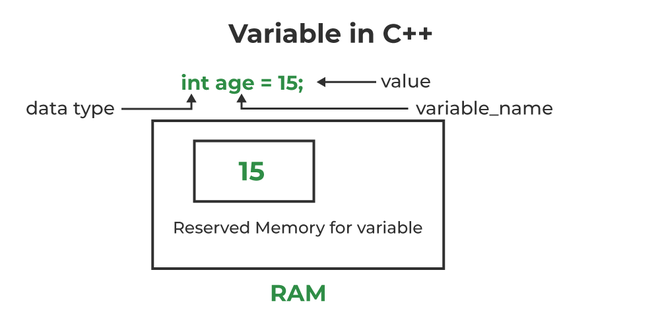

# 🔢 Variables in C++

In C++, a **variable** is a name given to a memory location. It is the basic unit of storage in a program. The value stored in a variable can be accessed or changed during program execution.

---

## 🧪 Example

```cpp
#include <iostream>
using namespace std;

int main() {
    // Creating an integer variable
    int num = 3;
    
    // Accessing and printing variable
    cout << num << endl;
    
    // Updating the value
    num = 7;
    
    // Printing updated value
    cout << num;
    
    return 0;
}
```

---

## 🏗️ Creating a Variable

Creating a variable and giving it a name is called **variable definition** (or declaration).

### Syntax:
```cpp
type name;
```

### Example:
```cpp
int a;
float b;
```

### Multiple variables:
```cpp
int x, y, z;
```

---

## ⚡ Initializing a Variable

A variable may contain garbage value if not initialized.

### Separate Initialization:
```cpp
int num;
num = 3;
```

### Direct Initialization:
```cpp
int num = 3;
```

📌 **Note:**  
If you assign a decimal value to an integer:
```cpp
int num = 3.14;  // becomes 3
```

---

## 🔄 Accessing and Updating

```cpp
#include <iostream>
using namespace std;

int main() {
    int num = 3;

    cout << num << endl;

    // Updating value
    num = 7;

    cout << num;

    return 0;
}
```

---

## 📏 Rules for Naming Variables

- Only letters (A-Z, a-z), digits (0-9), and `_`
- Must start with letter or underscore
- Case-sensitive (`num` ≠ `Num`)
- No spaces or special characters
- Cannot use C++ keywords (like `int`, `float`, `class`)

---

## 🔁 Using Variables

```cpp
#include <iostream>
using namespace std;

int main() {
    int num1 = 10, num2;

    num2 = num1;

    cout << num1 << " " << num2;

    return 0;
}
```

---

## ➕ Addition Example

### Without Variables:
```cpp
cout << 10 + 20;
```

### Using Variables:
```cpp
int num1 = 10, num2 = 20;
cout << num1 + num2;
```

---

## 🔒 Constant Variables

Constant variables cannot be changed.

```cpp
#include <iostream>
using namespace std;

int main() {
    const int num = 10;
    cout << num;

    return 0;
}
```

---

## 🌍 Scope of Variables

Scope defines where a variable can be used in the program.

- Inside function → Local scope  
- Outside function → Global scope  

---

## 🧠 Memory Management of Variables

- Each variable gets memory in RAM
- Local variables → may contain garbage value
- Global/static variables → default = 0
- Variables store values at specific memory locations

---

## 📊 Memory Representation



---

## 🚀 Summary

✔ Variables store data  
✔ Can be updated anytime  
✔ Must follow naming rules  
✔ Memory is allocated automatically  

---

💡 **Pro Tip:**  
Always initialize variables to avoid unexpected bugs ⚠️
