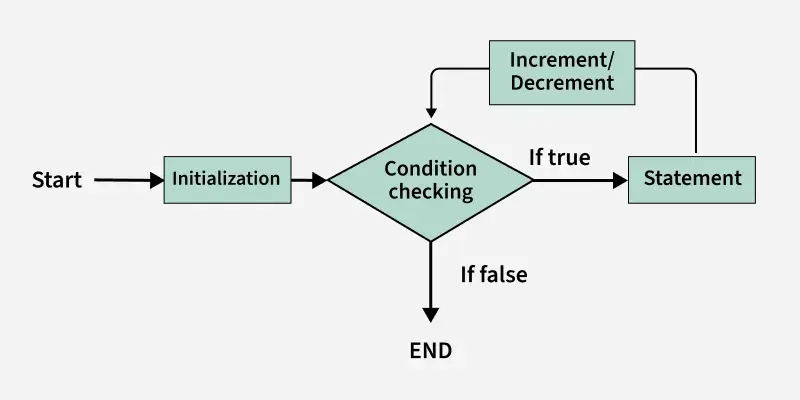
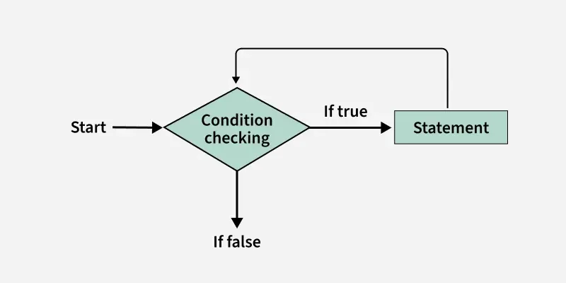
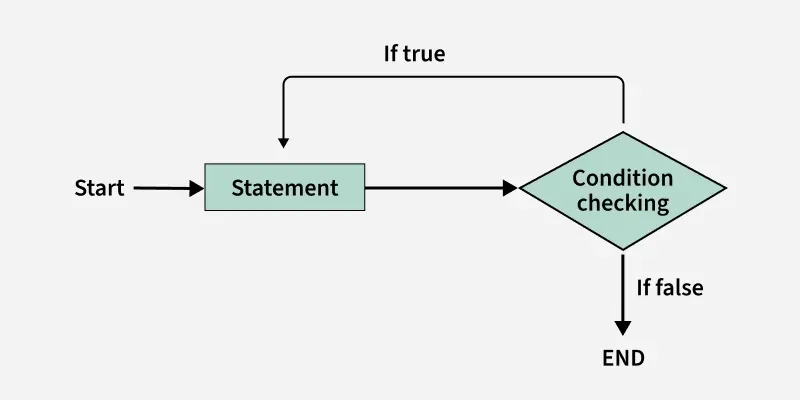

# 🔁 Loops in C++

In C++, loops are used to execute a block of code **multiple times**.

---

## ❌ Without Loop

```cpp
cout << "Hello World\n";
cout << "Hello World\n";
cout << "Hello World\n";
cout << "Hello World\n";
cout << "Hello World";
```

👉 Repetitive & inefficient

---

## ✅ Using Loop

```cpp
#include <iostream>
using namespace std;

int main() {
    for (int i = 0; i < 5; i++) {
        cout << "Hello World\n";
    }
    return 0;
}
```

✔ Less code  
✔ Scalable (5 → 100 → 1000)

---

# 🔢 Types of Loops in C++

1. for loop  
2. while loop  
3. do-while loop  

---

## 1️⃣ for Loop

👉 Entry-controlled loop (condition checked first)

### Syntax:
```cpp
for (initialization; condition; update) {
    // code
}
```

### Example:
```cpp
for (int i = 1; i <= 5; i++) {
    cout << i << " ";
}
```

### ✅ Output
```
1 2 3 4 5
```

📊 Flowchart:  


---

## 2️⃣ while Loop

👉 Used when iterations are **unknown**

### Syntax:
```cpp
while (condition) {
    // code
}
```

### Example:
```cpp
int i = 1;

while (i <= 5) {
    cout << i << " ";
    i++;
}
```

### ✅ Output
```
1 2 3 4 5
```

📊 Flowchart:  


---

## 3️⃣ do-while Loop

👉 Exit-controlled loop (runs at least once)

### Syntax:
```cpp
do {
    // code
} while (condition);
```

### Example:
```cpp
int i = 1;

do {
    cout << i << " ";
    i++;
} while (i <= 5);
```

### ✅ Output
```
1 2 3 4 5
```

📊 Flowchart:  


---

# 🔄 Range-Based (For-Each) Loop

Used for arrays & containers.

```cpp
int arr[] = {1, 2, 3, 4, 5};

// By value
for (auto it : arr) {
    cout << it << " ";
}

// By reference
for (auto &it : arr) {
    cout << it << " ";
}
```

📌 Difference:
- `auto it` → copy  
- `auto &it` → reference (can modify original)

---

# ♾️ Infinite Loop

```cpp
for (;;) {
    cout << "Infinite loop";
}
```

⚠️ Runs forever unless stopped

---

# 🔁 Nested Loops

```cpp
for (int i = 0; i < 3; i++) {
    for (int j = 0; j < 2; j++) {
        cout << "i = " << i << ", j = " << j << endl;
    }
}
```

---

# 🎮 Loop Control Statements

## 🔴 break
Stops the loop

```cpp
if (i == 2) break;
```

## 🟡 continue
Skips current iteration

```cpp
if (i == 2) continue;
```

---

# 🚀 Summary

✔ Loops reduce repetition  
✔ for → fixed iterations  
✔ while → unknown iterations  
✔ do-while → at least once  
✔ break & continue control flow  

---

💡 **Pro Tip:**  
Master loops → Pattern + DSA easy 🔥